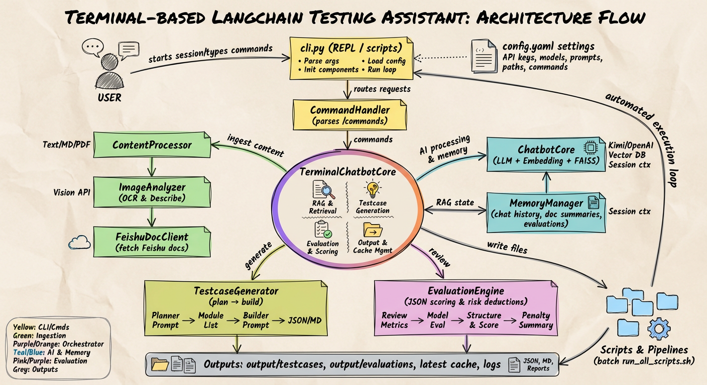

<div align="center">

# Training Camp

终端态 LangChain 助手，由后端驱动完成多源资料摄取、上下文组织与模型编排。项目聚焦：在 `config.yaml` 中集中配置命令、Prompt、模型与输出；提供可扩展的测试用例生成流程（规划→生成）与结构化评审接口；支持文本、图片、飞书 Wiki 等输入渠道，并内置脚本批处理能力以串联前端和自动化任务。当前评审模块以大模型实现，接口已预留，可随时切换到自研评分体系。

</div>

---

## 目录
- [Training Camp](#training-camp)
  - [目录](#目录)
  - [简介](#简介)
  - [核心能力](#核心能力)
  - [架构总览](#架构总览)
  - [系统目录](#系统目录)
  - [环境准备](#环境准备)
  - [快速开始](#快速开始)
  - [常用命令](#常用命令)
  - [配置指南](#配置指南)
  - [批处理场景](#批处理场景)
  - [文档](#文档)
  - [路线图](#路线图)
  - [贡献与致谢](#贡献与致谢)
  - [参考项目](#参考项目)

## 简介
将 PRD、文档、图片与飞书 Wiki 统一摄取为上下文，按模板生成结构化测试用例，并利用可替换的评审接口完成初步质量评估。所有能力均由 `config.yaml` 驱动，后端可在不改代码的前提下扩展命令、Prompt 与评分策略。


## 核心能力
- **多源摄取**：`ContentProcessor` 将文本/图片/飞书链接归一为 `ContentSegment`，图片自动按 `image_prompts` 分类应用对应 Prompt。
- **命令体系可配置**：在 `config.yaml` 的 `commands` 段定义自定义命令（如总结、润色、重写 PRD），终端即时可用。
- **Prompt 策略可控**：`testcase_modes`、`testcase_layouts`、`image_prompts` 提供多模板与版本化能力，支持快速迭代不同生成策略。
- **测试用例生成**：`TestcaseGenerator` 采用“规划 → 生成”双阶段流程，输出 JSON 或 Markdown，并维护 Planner 摘要与用例模块结构。
- **结构化评审**：`EvaluationEngine` 基于 `evaluation.review_metrics` 生成评分/摘要/风险列表，保留接口以便替换为自研评分器。
- **脚本批处理**：`cli.py -f` 与 `pipeline/run_all_scripts.sh` 支持 `.tcl/.txt` 脚本串行执行，便于夜间任务或批量评测。

## 架构总览
- **入口层**：`cli.py` 负责 REPL 与脚本模式，统一解析 `config.yaml` 并初始化核心组件。
- **终端交互**：`src/terminal/command_handler.py` 解析 `/命令`，`src/terminal/stream_handler.py` 负责流式输出与格式化。
- **生成核心**：`src/chatbot/testcase_generator.py`（计划+生成）、`src/chatbot/chatbot_core.py`（LLM/RAG 管理）、`src/chatbot/memory_manager.py`（摘要与缓存）。
- **评审体系**：`src/chatbot/evaluation_engine.py` 输出结构化 JSON，支持风险扣分与建议优先级推断。
- **资料处理**：`src/chatbot/content_processor.py` 统一文本/图片/链接，`src/utils/feishu_client.py` 负责飞书 API 交互。



## 系统目录
```
training_camp/
├── cli.py                     # 终端入口（REPL / 脚本模式）
├── config.yaml                # 模型、Prompt、命令、输出、评审配置
├── docs/                      # 设计/评审/模块说明等项目文档
├── output/                    # 生成的用例与评估结果
├── pipeline/                  # 批处理脚本与辅助资源
├── scrpits/                   # .tcl/.txt 批量命令脚本
├── src/
│   ├── chatbot/               # 生成、评审、内容处理、记忆管理
│   ├── terminal/              # 命令解析与流式输出
│   └── utils/                 # 飞书客户端、图片分析
└── langchain-chatbot/         # 历史版本备份（只读）
```

## 环境准备
- 操作系统：Linux x86_64（当前在终端 Conda 环境验证）
- Python：3.12（`requirements.txt` 已锁 `numpy<2`，兼容 `faiss-cpu==1.8.0`）
- 安装步骤：
```bash
conda create -n training_camp python=3.12 -y
conda activate training_camp
pip install -r requirements.txt
```
- 若 `lark-oapi` 出现兼容问题：`pip install lark-oapi==1.4.24`

## 快速开始
1. 在 `config.yaml` 的 `app` 段或环境变量中填入 API Key（文本模型与图片模型）。
2. 如需读取飞书资料，配置 `feishu.app_id` 与 `feishu.app_secret`。
3. 运行终端：
   ```bash
   python cli.py --config config.yaml
   ```
4. 使用 `/read <路径>`、`/read_link <feishu_url>` 导入资料，随后执行 `/generate_cases`、`/evaluate_cases` 生成并评审测试用例。


## 常用命令
| 命令 | 说明 | 常用参数 |
| --- | --- | --- |
| `/help` | 查看命令与描述 | – |
| `/read <path...>` | 读取本地文件并向量化 | 支持多个路径，自动识别文本/图片 |
| `/read_link <feishu_url>` | 拉取飞书文档并索引 | 需提前配置 `feishu` 凭证 |
| `/generate_cases` | 生成测试用例（JSON/Markdown） | `mode=default|smoke`、`output=...`、`format=markdown`、`thoughts=true`、`plan=true` |
| `/evaluate_cases <baseline> <candidate>` | 对比评审并输出 JSON | `output=...` 可指定结果路径 |
| `/history` `/save [file]` | 查看/保存对话历史 | `file` 默认为配置中的缓存路径 |
| 自定义命令 | 按 `commands` 配置执行，如 `/summarize`、`/suggest` | 模板支持 `{history}`、`{args}` 注入 |

## 配置指南
- 所有配置集中在根目录 `config.yaml`；通过调整该文件即可定制模型、命令、Prompt、输出与评分策略。
- **app**：模型 API、默认模型、系统 Prompt、欢迎 Banner、历史长度。
- **processing**：`embedding_model` 与 `text_splitter` 控制向量化与分片策略。
- **image_prompts**：图片分类器与多类型描述 Prompt，支持 `metadata.version` 管理版本。
- **testcase_modes**：定义 planner/builder Prompt、上下文限制与关联 `layout`。
- **testcase_layouts**：约束字段顺序、必填项与“测试方案摘要”清单，生成器通过 `{layout_schema}` 强制结构合法。
- **outputs**：设置用例/评审默认格式及输出目录。
- **evaluation.review_metrics**：定义评分维度（score/summary/risks），可扩展 metadata 与格式提示。
- **paths**：缓存最近用例路径、脚本日志位置等。
- **commands**：声明自定义命令模版，实现前端零改动的指令扩展。

## 批处理场景
```bash
# 逐个执行 scrpits/*.tcl，输出与终端一致
bash pipeline/run_all_scripts.sh

# 或直接使用 CLI 脚本模式
python cli.py --config config.yaml -f scrpits/sample.tcl --log-file ./output/logs/run.log
```
- `pipeline/documents`、`pipeline/links` 等目录可存放批处理所需的资料。
- `paths.script_log` 控制脚本模式日志落盘路径，便于追踪夜间任务。

## 文档
- `docs/MODULE_OVERVIEW.md`：逐文件说明、职责与扩展点。
- `docs/DESIGN_PRD_TEST.md`：测试用例生成策略与模板设计。
- `docs/EVALUATION_PLAN.md`：评审指标与扣分策略。
- `docs/RUN_SCRIPT_PLAN.md`：批处理方案与注意事项。
- `docs/OPTIMIZATION_IDEAS.md`：后续演进建议。

## 路线图
- [ ] 文档与输入：提升 `/read` 与 `/read_link` 的解析与摘要质量（文本/图片/飞书）。
- [ ] Prompt 策略：细化图片类型与文本策略的分层设计，支持版本灰度与对比实验。
- [ ] 命令扩展：沉淀常用命令集合（润色、结构化重写、质量检查），通过 config 配置直接启用。
- [ ] 评审接口抽象：临时 LLM 评价器，完善风险项策略与扣分规则；允许替换为自研评分器。
- [ ] 脚本支持：支持 flow 脚本一键运行，为 CI/CD 提供接口。

## 贡献与致谢
- 欢迎提交 Issue/PR，保持 snake_case 风格，并在描述中注明背景、变更点、测试方式与影响范围。
- 致谢：LangChain 生态、Moonshot/Kimi API、prompt_toolkit、rich、fastembed、faiss 等开源组件。

## 参考项目
- Best README Template: https://github.com/othneildrew/Best-README-Template
- LangChain Chatbot: https://github.com/shashankdeshpande/langchain-chatbot
- python_langchain_cn: https://github.com/liteli1987gmail/python_langchain_cn.git
