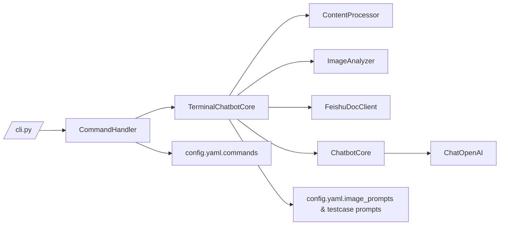

# LangChain 终端助手 → PRD 测试用例生成器升级方案

## 目标概述
在保持“无前端、纯终端交互”形态不变的前提下，将现有 CLI 聊天机器人升级为一个围绕 **PRD→测试用例生成** 与 **离线评测** 的工作台，并增强图片/链接解析、Prompt 配置、指标计算等能力，使之能够满足 Coursework 中的真实需求。

---

## 总体架构

```
training_camp/
├── cli.py                          # 交互入口，新增场景指令/模式切换
├── config.yaml                     # 全量配置：模型、Feishu、Agent Prompt、图片分类 Prompt、命令等
├── src/                            # chatbot / terminal / utils 模块
├── docs/                           # DESIGN_PRD_TEST、MODULE_OVERVIEW 等
├── output/                         # 生成的用例 & 评测报告
├── pipeline/                       # 课程示例 / 数据脚本
├── scrpits/                        # `.tcl` / `.txt` 批处理脚本
└── langchain-chatbot/              # 老版本代码备份（如需参考）
```

---

## 功能改造拆解

### 1. Prompt 管理与 Agent 初始化
- `config.yaml.app.system_prompt`: 作为**默认 Agent Prompt**。允许多套配置（可新增 `agents` 数组，支持 `/switch_agent <name>`）。
- `commands` 段继续承载通用指令；`/generate_cases`、`/evaluate_cases` 改为“内置命令”。
- 新增 `image_prompts` 配置块：
  ```yaml
  image_prompts:
    diagram_classifier_prompt: "... 如何判定是流程图/实体图 ..."
    flow_chart_prompt: "... 针对流程图的抽取步骤 ..."
    ui_mock_prompt: "... UI 截图提取控件与状态 ..."
  ```
  => ImageAnalyzer 先跑分类 prompt，再根据类型调用对应模板生成结构化描述。

### 2. 文档/图片/链接输入
- 保持 `/read` `/read_link`，但在 `ContentProcessor` 里将每份素材转换为 **统一的 PRD 片段结构**：
  ```python
  {
    "type": "text/pdf/image/link",
    "source": "...",
    "content": "...",
    "meta": {"image_type": "flow_chart", ...}
  }
  ```
- 图片处理流程：
  1. 统一使用视觉模型（如 moonshot 8k vision）。
  2. 先调用 `diagram_classifier_prompt` 判断类型。
  3. 根据类型套入自定义 prompt 生成 JSON（字段：type/summary/key_elements/risks），存入 `content`。
  4. 保留原图路径到 `meta`，方便溯源。

### 3. PRD → 测试用例生成
- 新增 `/generate_cases [--mode smoke|full --output xxx.md --format md|json --show-thoughts true|false --plan true|false]` 指令（CLI 支持顺序参数与 `mode=... output=... format=... thoughts=... plan=...` 键值写法，`format` 控制落盘格式，`thoughts` 控制 Planner Panel，`plan` 控制“测试方案摘要”展示）。
- 流程：
  1. `TerminalChatbotCore.run_testcase_generation()` 读取当前所有已索引文档内容（可按 chunk 或主题聚合）。
  2. 调用配置中的 `testcase_generation_prompt`（可嵌入图片描述/Feishu内容），并基于 `testcase_layouts.<layout>` 注入字段 schema（`{layout_schema}`），要求 LLM 以 JSON 输出 `module_goal + cases[]`。
  3. 框架解析 JSON→`TestcaseDocument`，打包 `plan_summary`（来自模板 checklist），并按用户指定的 `format` 渲染为 Markdown/JSON 保存到 `./output/testcases/<timestamp>.md|json`（默认 JSON，包含 `metadata = {generated_at, config_hash}`）；若 `plan=true` 则在终端以 Rich Panel 展示 checklist。
  4. 若提供 `--mode smoke` 则仅生成关键场景；`--mode full` 生成完整覆盖。

### 4. 自动化评测
- `/evaluate_cases --baseline path/to/manual.md --candidate path/to/generated.json`
- 流程：
  1. 自动解析输入文件：若 `candidate` 缺失，则使用 `latest_testcase_cache` 中记录的最近一次 `/generate_cases` 结果；若 `baseline` 缺失，则注入占位说明。
  2. 指标全部定义在 `config.evaluation.review_metrics`（示例：alignment / coverage / bug_prevention），每个指标都要求 LLM 输出 `{"score":0-100,"summary":"...","risks":["..."]}`，并可通过 `format_hint` 强化 JSON 约束。
  3. `EvaluationEngine` 解析 JSON，将 `score` 按 `risks` 数量套用扣分规则（默认每条 -5，封顶 40），再拼入 `summary`/`suggestions`。
  4. 报告保存在 `./output/evaluations/<timestamp>_report.json`，`metadata` 含 `generated_at` 与 `config_hash`，方便追溯配置版本。

### 5. CLI 交互增强
- `/help` 列出新命令。
- `/show_docs`：查看当前索引的文档列表（含来源、类型）。
- `/switch_agent <name>`（可选）：在 config 中预定义多套 `agents`（system prompt + 定制命令）。
- `/config info`：打印当前关键配置（模型、图片 prompt、Feishu 状态等）。

---

## 调用关系



---

## 命名与代码规范
- 保持 `snake_case`，遵循 Google Python 风格。
- 新增函数命名建议：
  - `ContentProcessor.build_content_segments()`
  - `ImageAnalyzer.classify_image_type()`
  - `TerminalChatbotCore.run_testcase_generation()`
  - `TerminalChatbotCore.run_evaluation()`
- CMD 参数解析统一集中在 `CommandHandler`，避免 CLI 入口膨胀。

---

## 交付产物
1. **代码实现**：上述模块改造 + 新函数。
2. **配置样例**：`config.yaml` 里包含不同图片 prompt、测试生成 prompt、评测指标。
3. **文档**：
   - `docs/DESIGN_PRD_TEST.md`（本规划）；
   - `README` 更新新命令；
   - `USAGE_CN.md` 标明如何准备人工用例、如何运行评测。
4. **示例数据**：
   - `data/manual_cases/sample.md`：人工写的基准用例；
   - `./output/testcases/example.json`、`./output/evaluations/example.json` 展示终端输出格式。

---

## 迭代建议
- 第一阶段：完成输入解析 + `/generate_cases` + `/evaluate_cases`（LLM 指标即可）。
- 第二阶段：加规则/Embedding 检查（步骤覆盖率等）。
- 第三阶段：考虑接入多代理流程（如 LangGraph，生成→审阅→评测 pipeline）。

---

通过上述规划，可以在当前终端框架上实现 PRD→测试用例生成与自动评测闭环，同时保留图片/链接扩展能力，并让所有 Prompt/模型选择都可在 `config.yaml` 中自定义。这样既满足 Coursework 要求，也便于后续灵活迭代。

### 核心类职责
- `ContentProcessor`：统一将本地/Feishu/图片内容转为 `ContentSegment`（type/source/content/metadata）。
- `TerminalChatbotCore`：持有 `loaded_segments`、向量索引、并协调生成/评测流程。
- `TestcaseGenerator`（嵌入在 TerminalChatbotCore 中的 `run_testcase_generation`）：根据 `testcase_modes` prompt 生成结构化 `TestcaseDocument`，默认落盘 JSON。
- `EvaluationEngine`（`run_evaluation`）：解析 `review_metrics` 的 JSON 输出，根据 `risks` 自动扣分；若需要额外 Prompt，可在 `evaluation_metrics` 中扩展。

- `TerminalChatbotCore`：负责装配上下文、触发生成/评测流程、维护最新用例路径缓存，以及统一的结果落盘逻辑（`./output/testcases`、`./output/evaluations`）。
